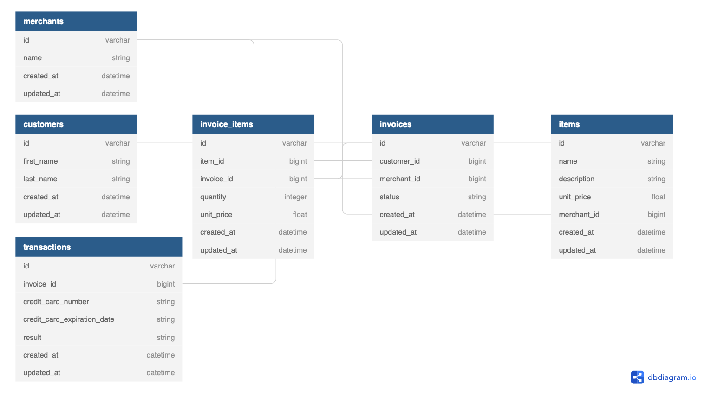

# README

## Introduction

*Rails Engine* is an back end application that imports e-comerce data from various CSV files and exposes that data to a remote front end application, *Rails Driver* as API endpoints. Data is brought in using a rake task to read CSV files and instantiate each pice of data as a unique ruby object -- items, merchants, customers, invoices, transactions, and invoice_items. 

The front end application was an existing rails application that was looking for various API endpoints. In order to hit each endpoint ReSTful routes in the back end application were created. Each rout used a serializer to deliver customized JSON formatted data to the front end. 

API endpoints such as `index`, `show`, `create`, `update`, and `destroy` were the basic endpoints first implemented. However to further show the range of customization other routes were exposed such as `find`, `find_all`, `most_items_sold`, `total_revenue` for one merchant, and `total_revenue_between_date_range` for all merchants. Each of these advanced API endpoints were namespaced to abide by ReSTful routes and accomplished through the use of Active Record calls with SQL injections when necessary. 

## Requirements
* Ruby 5.2.3
* Rails 5.2.4.3

## Database
* PostgreSQL

## Schema

